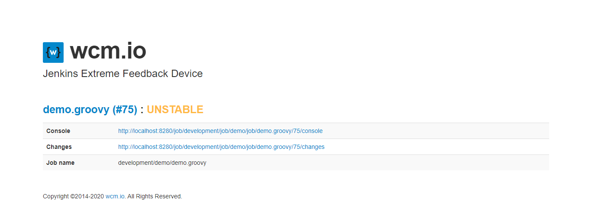

> :information_source: **Unmaintained**
>
> This project is currently not maintained.

# Jenkins extreme feedback device (jxfd)

This role sets up a Pyhton based [MQTT](https://en.wikipedia.org/wiki/MQTT) client which controls a USB
traffic light (or compatible device) from
[Cleware GmbH](https://www.cleware-shop.de/) based upon MQTT Messages
send from a Jenkins with the
[MQTT Notification Plugin](https://wiki.jenkins.io/display/JENKINS/MQTT+Notification+Plugin).

This role was developed to easily integrate with the
[`notify.mqtt`](https://github.com/wcm-io-devops/jenkins-pipeline-library/blob/master/vars/notify.groovy)
step from the [wcm.io DevOps Jenkins Pipeline Library](https://github.com/wcm-io-devops/jenkins-pipeline-library)

The role will also setup a webserver which displays details to the Job
currently displayed by the traffic light:

## How does it work?

The client is connecting via
[paho-mqtt](https://pypi.org/project/paho-mqtt/) to a MQTT broker
(`jxfd_mqtt_server_host`). Depending on the topic and the payload the
traffic light is controlled.

When you enter the IP or the hostname of the client in your browser you
will get a status page with information about the current displayed
build status.

:bulb: The last received payload is stored in a file called
`last_payload.yml`, so the last displayed state is kept during events
like service restarts or reboots.

### Topic

The default topic is `jenkins/${JOB_NAME)}`. So assuming you are
structuring you jobs using Folders and you have a job called mqtt-test
located in the following structure:

    Jenkins
      development
        local
          mqtt-test    

the topic will be `jenkins/development/local/mqtt-test`.

The client can subscribe to 1 to n MQTT topics (`jxfd_mqtt_topics`). Per
default the client is subscribing to `jenkins/#`.

The `#` is a multilevel wildcard. So in this case the client will
subscribe to each jenkins topic. `jenkins/development/local` would only
subscribe to notifications from jobs in the `development/local` folder
and below.

See also
https://www.hivemq.com/blog/mqtt-essentials-part-5-mqtt-topics-best-practices/
for more information.

### MQTT payload

The client expects a message in the `yaml` format with the following
example payload:

    'BUILD_NUMBER': 76, 
    'BUILD_RESULT': 'FIXED', 
    'BUILD_RESULT_COLOR': '#63a80e', 
    'BUILD_URL': 'http://localhost:8280/job/development/job/demo/job/demo.groovy/76/', 
    'JENKINS_URL': 'http://localhost:8280/', 
    'JOB_BASE_NAME': 'demo.groovy', 
    'JOB_DISPLAY_URL': 'http://localhost:8280/job/development/job/demo/job/demo.groovy/display/redirect', 
    'JOB_NAME': 'development/demo/demo.groovy', 
    'RUN_CHANGES_DISPLAY_URL': 'http://localhost:8280/job/development/job/demo/job/demo.groovy/76/display/redirect?page=changes', 
    'TIMESTAMP': 1579781692

:bulb: Have a look at the
[`notify.mqtt`](https://github.com/wcm-io-devops/jenkins-pipeline-library/blob/master/vars/notify.groovy)
step for an example for how to build and send this message.

The client will switch on the specific light for the received
`BUILD_STATUS`.

* red: `FAILURE`, `STILL_FAILING`
* yellow: `UNSTABLE`, `STILL UNSTABLE`
* green: `SUCCESS`

## Clewarecontrol

In order to communicate with the Clewaredevice this roll will clone a
specific version of the https://github.com/flok99/clewarecontrol.git
repository and compile the binary for you.

## Client

The client is located at `/opt/jxfd`. You can start the client for
debugging purposes with:

    /usr/bin/python3 /opt/jxfd/client.py --config /opt/jxfd/config.yml

:bulb: Make soure to stop the `jxfd` service before!

### Configuration

The client expected the following configuration format:

    mqtt:
      host: mqtt.company.tld
      topics: ['jenkins/#']
    device: 123456

### Service

This role installs a systemd service at this location: `/etc/systemd/system/jxfd.service`

You can control this service by using:

    systemctl stop|start|restart jxfd.service

For debugging purposes you can view the systemlog:

    journalctl -f -u jxfd.service

## Tested devices

his role was tested with the "USB-TischAmpel" and a RaspberryPI 4.

## Requirements

This role requires Ansible 2.8 or higher.

## Role Variables

Available variables are listed below, along with default values:

    jxfd_pip_packages: [] # look into defaults.yaml

The required pip packages to install.

    jxfd_os_packages: [] # look into defaults.yaml

The required os packages to install.

    jenkins_feedback_device_docroot: /var/www/html

Document root for the status page.

    jxfd_owner: jxfd
    jxfd_group: "{{ jxfd_owner }}"

Owner and group of files and folders.

    jxfd_basedir: /opt/jxfd

Base directory for the client.

    jxfd_script: "{{ jxfd_basedir }}/client.py"

Path to the client script.

    jxfd_config: "{{ jxfd_basedir }}/config.yml"

Path to the configuration.

    jxfd_clewarecontrol_version: 8b76079d193b4438dc89abac85b3fc99c35e1d08

Fixed version of clewarecontrol repository.

    jxfd_clewarecontrol_basedir: /opt/clewarecontrol

Clone directory of the clewarecontrol repository.

    jxfd_mqtt_server_host: localhost

The MQTT server to use.

    jxfd_mqtt_topics:
      - "jenkins/#"

The MQTT topics to listen to. Listen to all jenkins topics per default.

    # jxfd_cleware_device_sn:

Optional, specify the cleware device serial number to use. :bulb:
Clewarecontrol will use the first found device by default.

## Example

This example setups a client subscriping to a MQTT server located at
`mqtt.company.tld` and a Cleware device with a serialnumber of `123456`.

    - name: Setup jenkins extreme feedback device
      hosts: raspberrypi
      vars:
        jxfd_mqtt_server_host: mqtt.company.tld
        jxfd_cleware_device_sn: 123456
      roles:
        - role: wcm_io_devops.jenkins_xfd
          tags:
            - client

## License

Apache 2.0